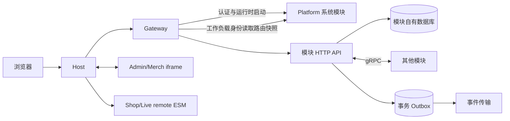

# LiveShop 插件化微服务架构

> 状态：当前生效
> 适用范围：LiveShop 运行拓扑和仓库边界
> 所有者：Platform Architecture
> 最后核对：2026-08-12

跨仓协作、工程结构和通信规则见 [`TEAM-DEVELOPMENT-STANDARD.md`](./TEAM-DEVELOPMENT-STANDARD.md)，模块接入细则见 [`MODULE-DEVELOPMENT.md`](./MODULE-DEVELOPMENT.md)。

## 1. 不可突破的边界

四端 Host 是由相邻 `liveshop-gateway` 仓库拥有的稳定技术骨架，负责启动、会话、租户上下文、布局、全局样式变量、国际化、权限、模块装载、错误隔离和遥测。Host 不拥有领域页面或领域 API 客户端。

业务模块是可独立发布的垂直切片，拥有自己的业务状态、数据库、状态机、HTTP 接口、公开 gRPC 契约实现和所需前端贡献。

Platform 是控制面。PostgreSQL 保存不可变发布、活动版本和单调递增的路由 revision。注册和激活在串行化事务中锁定并更新权威快照。Platform 不是运行时服务发现组件；服务实例由 Kubernetes DNS 或等价基础设施解析。

Platform 同时拥有后台 Identity、租户 IAM、非敏感平台配置和只追加的审计查询。详细所有权、身份状态和控制面不变量见 [`PLATFORM-CONTROL-PLANE.md`](./PLATFORM-CONTROL-PLANE.md)。

Gateway 是由相邻 `liveshop-gateway` 仓库实现的无状态数据面组件。它从 Platform 接收活动 HTTP 路由，拒绝内部路由，使用最长前缀匹配，并在刷新失败时保留最后一个有效快照。

Gateway 是浏览器 CORS 的最终边界。代理响应返回前会移除模块服务自己的 CORS header，避免同一响应携带冲突策略。

## 2. 运行时通信

Admin 和 Merchant contribution 默认使用跨 origin iframe，以隔离发布和 CSS。Shop 和 Live contribution 默认使用经过完整性校验的 remote ESM，因为它们需要共享导航、会话和播放器上下文。

Host 永远不会把原始登录令牌交给 iframe 或 remote。Platform 先验证 IdP 签发、只包含已认证 subject 与 tenant 的访问身份，再由 Platform IAM 从 PostgreSQL 事实源解析角色、权限、部门成员关系和数据范围。随后签发五分钟有效的 Ed25519 Module Session，并绑定 issuer、audience、subject、token ID、模块发布、surface、contribution、tenant、授权 revision、权限、数据范围和允许的 method/path。

后台身份还必须携带 realm：`PLATFORM` 仅允许进入 Admin；`MERCHANT` 仅允许进入 Merchant、Shop 和 Live。Platform、Gateway 和模块中间件都会重复校验该边界。

Gateway 在代理前进行 Module Session 粗粒度校验，接收模块再次校验 audience、surface、permission、method、path 和 tenant。浏览器提供的 tenant 字段和静态 Host access token 都不是可信协议输入。同步 gRPC 使用 TLS 1.3 双向认证和已授权的 SPIFFE 工作负载身份。

控制面接口也使用短期 Ed25519 工作负载身份。Gateway 只有路由读取权限，模块发布 CI 只有发布注册和激活权限。Platform 将可信公钥 ID 固定映射到 subject 和 permission 集合，因此签名令牌不能自行声明更高权限。

## 3. IAM 与组织所有权

模块在不可变 Manifest 中声明权限定义（`code`、`resource`、`action`、显示名称）。激活时，Platform 在更新活动发布的同一串行化事务中同步模块拥有的权限目录。Manifest 可以定义能力，但不能授予能力。

Platform PostgreSQL 是部门、角色、角色权限、用户角色分配、用户部门归属和资源数据范围规则的唯一事实源。所有记录按 `app_id + merchant_id` 隔离。部门和角色写入是基于资源 ID 的幂等 PUT 命令；更新必须携带预期聚合版本，陈旧写入返回 `409`，不能覆盖并发修改。部门和角色只能在 `ACTIVE` 与 `DISABLED` 之间转换；修改部门父级时拒绝形成环。被委派的 IAM 管理员不能创建、删除或修改超级管理员标记。

数据范围由 Platform 解析：

- `ALL`：认证租户内的全部记录；
- `DEPARTMENT`：用户所属的活动部门；
- `DEPARTMENT_AND_CHILDREN`：活动部门及其活动后代；
- `CUSTOM`：显式分配的活动部门；
- `SELF`：由当前认证 subject 拥有的记录。

多个活动角色的权限和数据访问范围取并集。缺少角色、权限或数据范围时默认拒绝。模块后端只接收本模块的权限和数据范围子集，并必须把它应用到事实源查询；浏览器提供的部门 ID 永远不能作为授权依据。

IAM 管理是 Platform 自有的普通 Admin contribution。其 iframe 使用 Platform Module Session，经 Gateway 下的 `/admin/platform/iam` 路由调用；技术 Host 不拥有 IAM 页面或 IAM 实现代码。接口要求 `platform.iam.manage`。内置超级管理员由部署流程初始化，普通 IAM API 不能创建新的超级管理员。授权变化会增加租户 IAM revision，新签发的 Module Session 携带新 revision，已签发会话最多在五分钟内过期。

## 4. Contribution 生命周期

1. 模块 CI 测试后端和所有已声明前端 artifact。
2. CI 发布不可变后端镜像和前端 artifact。
3. CI 计算 artifact 摘要并生成 `module.json`。
4. Platform 拒绝非法 Manifest、冲突路由和内容变化的重复版本。
5. 对已安装但未激活的发布运行集成测试。
6. 激活操作原子切换活动发布。
7. Gateway 刷新路由，Host 刷新 contribution。

## 5. 分布式一致性

- 每项业务事实只有一个所有模块和一个权威数据库。
- 每次状态转换都检查预期旧状态或聚合版本。
- 每个可重试命令都有稳定幂等键。
- 数据库状态和待发布事件通过 Outbox 在同一本地事务中提交。
- 消费者通过 Inbox/event ID 和聚合版本拒绝重复或陈旧事件。
- 外部调用超时进入“结果未知”，不能直接判失败；通过外部事实源查询对账。
- 资金、库存、配额和订单流程不能降级为无操作依赖。

## 6. 仓库模型

本仓库本身就是 Platform 控制面/系统模块，其发布 Manifest、`backend` 和 `frontend-admin` 位于仓库根目录，与独立业务模块保持一致。后端命名空间 `backend/internal/platform` 顶层固定为 `app/application/cmd/common/registry`。HTTP 使用 GoFrame `ghttp`，请求沿 `application/platform/api/v1 → controller → service → logic` 进入能力事实源，由 `application/platform/router` 以 `g.Bind` 注册。公开 gRPC 线协议位于 `backend/contracts/proto/platform/v1`，生成客户端位于 `backend/contracts/gen/go/platform/v1`；gRPC controller 与 HTTP controller 复用同一个 `service.Registry` 和 `logic` 实例，`common/grpcserver` 使用 Kernel `grpcx` 安装 request ID、恢复和日志，并负责 TLS 1.3 mTLS、SPIFFE 方法授权、标准 health 与优雅停机。`registry.Dependencies` 保存 bootstrap 后的完整进程依赖，事实实现位于其 `audit/iam/identity/module/settings` 子包；`app` 负责 bootstrap 与 HTTP/gRPC 进程生命周期。Platform 的监听地址、日志、数据库、身份、CORS 和 TLS 配置只来自 `-config` 指定的完整 YAML，不存在环境变量覆盖。架构中不存在嵌套 `modules` 工作区。

浏览器入口、四端 Host、Host Runtime 和数据面 Gateway 位于独立的相邻 `liveshop-gateway` 仓库。每个业务模块也位于独立仓库，拥有 Manifest、后端、数据库迁移、公开 gRPC 契约、前端贡献、测试和发布元数据。

本地开发可以使用指向相邻仓库的 workspace replacement。发布 Manifest 和模块源码必须依赖已发布、已版本化的 Platform artifact，不能导入 Platform 源码路径。部署 BOM 固定 Platform SHA、模块 SHA、契约版本、migration 版本和 artifact 摘要。
