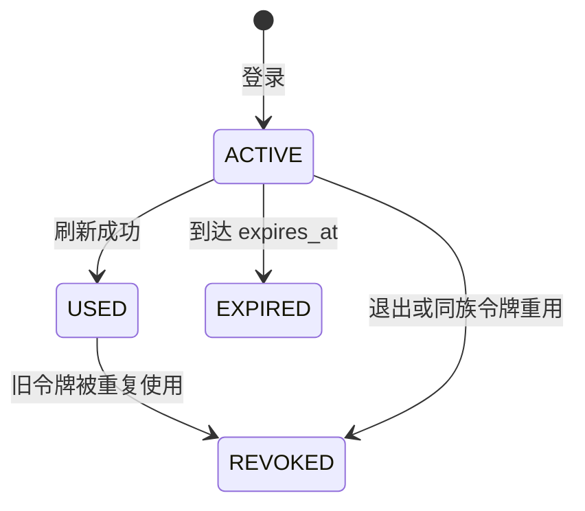

# Platform 控制面规范

> 状态：当前生效
> 适用范围：Platform Identity、IAM、Registry、Settings 和 Audit
> 所有者：Platform Engineering
> 最后核对：2026-08-12

本文是 Platform 专属业务和安全不变量的权威文档。跨仓协作与模块通信规则见 [`TEAM-DEVELOPMENT-STANDARD.md`](./TEAM-DEVELOPMENT-STANDARD.md)。

## 1. 所有权边界

Platform 拥有跨模块治理，业务模块拥有自己的业务事实和工作流。代码位置由被修改事实的所有权决定，而不是由发起操作的页面决定。

| 能力 | 所有者 | 原因 |
|---|---|---|
| 后台登录、刷新会话、退出 | Platform Identity | 所有 Host 和模块共用一个认证边界 |
| 账号、角色、部门、权限授予和数据范围 | Platform IAM | 模块可以声明能力，但不能自行授权 |
| 模块发布、激活、路由和 contribution 快照 | Platform Registry | 活动模块图只能有一个权威来源 |
| 非敏感平台配置 | Platform Settings | 需要乐观并发和审计的公共治理能力 |
| 安全与配置审计查询 | Platform Audit | 跨模块、只追加的证据 |
| Host 外壳、登录页、布局和模块装载 | Gateway Host Runtime | 稳定技术外壳，不包含业务页面；浏览器 Platform 流量经 Gateway 进入 |
| 商品、订单、支付、库存和直播状态 | 对应业务模块 | 业务模块是唯一事实源 |
| 模块专属配置和权限定义 | 模块 Manifest/API | Platform 只登记和授权，不实现领域 |
| 领域 Outbox/Inbox 和补偿状态机 | 对应业务模块 | 必须与模块自己的业务事务协调提交 |

## 2. 两个后台安全 Realm

`PLATFORM` 身份只能进入 `admin` surface。`MERCHANT` 身份可以进入 `merch`、`shop` 和 `live`，不能进入 `admin`。查询 contribution、签发 Module Session、Gateway 代理以及接收模块都会重复检查该边界。隐藏菜单永远不能替代后端授权。

`PLATFORM` 用户名全局唯一，总后台登录只接收用户名和密码。服务端从账号事实记录解析授权范围，忽略浏览器为该 realm 提供的应用或商户 ID。`MERCHANT` 登录仍要求 `app_id + merchant_id`，因为商户用户名只在租户内唯一。

当前 Platform 账号只在该账号记录保存的 `app_id + merchant_id` 范围内授权，因此运营人员是一个被委派租户范围内的平台管理员，而不是无限制 SaaS Root。未来如果建设跨商户运营中心，必须引入明确的平台组织范围和委派租户访问，禁止使用 `merchant_id=0` 或静默绕过租户过滤。

仅本地 seed 会创建：

| Surface | 用户名 | 密码 | Realm |
|---|---|---|---|
| Platform Admin | `admin` | `admin` | `PLATFORM` |
| Merchant Admin | `merch@sufeipay.com` | `123456` | `MERCHANT` |

生产 migration 不会创建上述账号。这些弱凭据只允许用于本地 seed，不满足生产密码策略。初始管理员必须由部署工具显式创建。

## 3. 认证协议与状态

密码以 bcrypt hash 保存。登录成功返回 15 分钟有效的签名访问身份，并通过 `HttpOnly`、`SameSite=Lax` Cookie 设置七天有效的不透明 refresh token；数据库只保存 refresh token 的 SHA-256 摘要。连续五次密码错误会锁定账号 15 分钟，第五次及之后返回 `429`；重置密码会清除锁定。

Refresh token 只能使用一次，并在事务中原子轮换：



重复使用 `USED` token 会撤销整个会话族，包括最新 token。退出操作具备幂等性。Access token 是无状态令牌，最长可能继续有效 15 分钟，因此高权限接口仍依赖五分钟有效的 Module Session 和当前 IAM 解析结果。

Platform 账号管理会列出当前租户范围内的 `PLATFORM` 与 `MERCHANT` 账号。账号写入使用 `expectedVersion`，陈旧写入返回 `409`。新账号密码至少 12 个字符。修改密码或停用账号时，在同一事务中撤销全部活动 refresh session。操作人员不能停用自己的账号。任何 API 都不能返回账号凭据，审计详情也不能复制凭据。

## 4. RBAC、菜单、按钮与 API

不可变的 `module.json` 是能力声明：

- `permissions` 注册权限码和展示元数据；
- `contributions` 声明 Admin/Merchant 页面、路由、标题和顺序；
- `requiredPermissions` 决定 contribution 是否返回；
- `allowedRoutes` 将 Module Session 绑定到准确的 HTTP method 和路径前缀。

Platform IAM 是唯一授权源。它解析活动角色、部门关系和数据范围，再由 Platform 签发与 contribution 绑定的 Module Session。Host 根据返回的 contribution 生成菜单；模块依据权限子集隐藏或禁用按钮；Gateway 和模块后端分别执行相同的 method/path/permission 契约。因此菜单、按钮和 API 授权来自同一授权事实，但只有后端校验可以作为安全边界。

`admin` 与 `merch` 是独立的 Manifest surface。模块需要同时支持二者时，必须声明两个 contribution，并使用独立权限码和 allowed route；注册其中一个不能让它出现在另一个控制台。

## 5. 模块生命周期不变量

- 发布版本不可变；使用不同内容重复注册同一版本必须失败。
- 同一模块只能有一个活动版本。
- 激活和全局路由 revision 在同一串行化事务中变化。
- 活动路由前缀冲突必须在事务提交前拒绝。
- 停用后，下一份快照移除对应路由和 contribution。
- `platform` 控制面模块不能通过自己的控制台停用自己。
- Gateway 是只读数据面消费者；Platform 临时不可用时保留最后一个有效快照。

模块发布 CI 使用短期工作负载身份。浏览器身份不能调用 Registry 内部写接口，Gateway 也不能注册或激活发布。

## 6. Platform Settings

Settings 是按 realm、app 和 merchant 隔离的 JSON 对象。每次更新都必须携带 `expectedVersion`，陈旧写入返回 `409`。配置文档更新和 `settings.update` 审计事件在同一串行化数据库事务中提交；重复写入相同值具备幂等性。

Settings 禁止保存 Secret。系统会递归拒绝命名空间 `secrets` 以及 `password`、`secret`、`token`、`privateKey`、`credential`、`apiKey` 等键名。Secret 应保存在部署 Secret Manager 中，由部署系统生成完整进程 YAML 或只读凭据文件并挂载到对应工作负载，不能转成环境变量配置。

## 7. 审计范围

`platform_audit_event` 在应用边界只追加并按租户隔离。当前记录登录成功/拒绝、refresh token 重用检测、账号管理、IAM 修改、运营人员触发的模块激活/停用和平台配置更新。Identity、IAM、Registry 和 Settings 必须在权威状态修改的同一串行化事务中追加审计事件，不能用事务提交后的尽力日志调用代替。

## 8. 本地验证

启动容器后运行完整控制面验证：

```powershell
./backend/tools/smoke-platform-controls.ps1
```

验证覆盖账号创建/更新/停用、陈旧账号写入、自我停用拒绝、登录锁定与密码重置恢复、两个 realm 的越界访问、refresh token 轮换与会话族撤销、Registry 可见性、控制面自保护、Settings 乐观锁、Secret 拒绝和原子审计事件。
