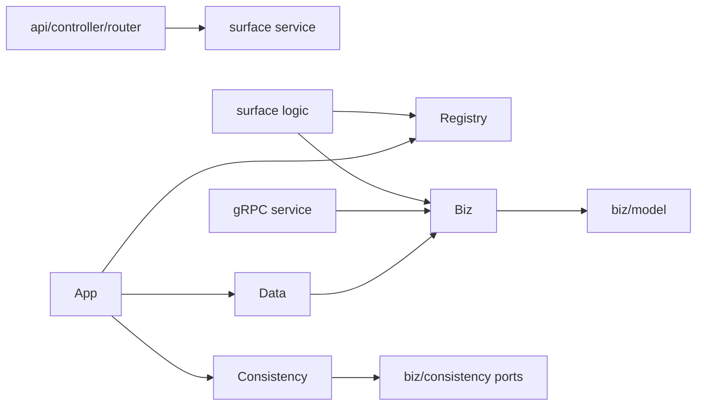
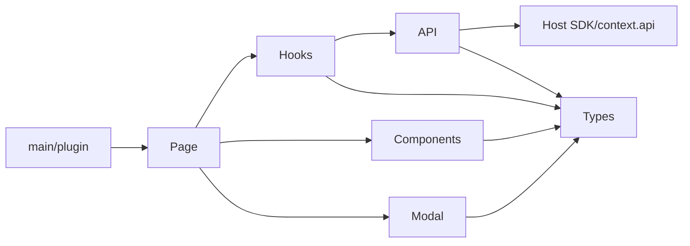

# LiveShop 多人协同开发规范

> 状态：当前生效
> 适用范围：`kernel-go`、`liveshop-platform`、`liveshop-gateway`、所有独立业务模块仓库
> 规范所有者：Platform Architecture / Platform Engineering
> 最后核对：2026-08-12

本文是 LiveShop 多仓工程的跨团队协作基线，统一规定仓库职责、模块结构、协作流程、文档产出、系统通信、质量门禁和交付信息。各仓库 `AGENTS.md`、`ownership.yaml`、`dependency-policy.yaml` 可以收紧本规范，但不能放宽公共安全、模块边界和一致性要求。

规范中的“必须”“禁止”是合并门禁；“应”表示默认方案，偏离时必须在设计记录中说明理由、影响和替代保护。

## 1. 核心原则

1. **一个业务事实只有一个所有者。** 模块及其数据库是事实源；其他模块只能通过公开契约读取或订阅派生事件。
2. **按垂直能力交付。** 一个功能必须同时完成领域规则、接口、权限、前端、迁移、测试、Manifest 和运行文档，不能只交付某一层。
3. **契约先于并行实现。** HTTP、gRPC、事件、状态机或数据库语义先达成书面契约，再按稳定目录所有权并行开发。
4. **直接演进唯一主路径。** 仓库内调用方随主实现一起迁移；未经明确外部兼容要求，不增加 feature flag、双读双写、fallback、legacy adapter 或新旧路由。
5. **共享文件单写者。** `module.json`、Proto、migration 序号、组合根和发布脚本在一个任务周期内各有唯一编辑者。
6. **代码、契约、文档同一变更交付。** 文档不是事后补写；事实源、不变量、失败恢复和操作方式属于实现的一部分。
7. **验证结果而非完成动作。** 合并依据是业务不变量、最终状态、副作用次数、真实路由和构建结果，不是“代码已写完”。

## 2. 当前工程全景与仓库职责

```text
liveshop-ai/
├─ kernel-go/            # 域中立 Go 运行时
├─ liveshop-platform/    # 控制面、公共契约、Host SDK、Platform 系统模块
├─ liveshop-gateway/     # 数据面 Gateway、四端 Host、Host Runtime
└─ liveshop-modular/     # Catalog 独立业务模块参考实现
```

| 仓库 | 拥有 | 禁止拥有 | 当前验证入口 |
|---|---|---|---|
| `kernel-go` | 身份令牌、Module Session、工作负载身份、gRPC、生命周期、日志、应用错误等域中立能力 | 业务模型、模块路由、租户业务规则 | `go test ./...` |
| `liveshop-platform` | Identity、IAM、Registry、Settings、Audit；Manifest Schema；Host SDK；Design Tokens；Platform Admin contribution | Gateway 实现、四端 Host、Catalog/Order/Payment 等业务实现 | `./backend/tools/verify.ps1` |
| `liveshop-gateway` | 无状态路由代理、Module Session 校验、路由快照、CORS、四端 Host、Host Runtime | 业务事实、IAM 事实、模块注册事实、跨模块业务编排 | `./tools/verify.ps1` |
| 独立业务模块 | 自身领域事实、数据库、迁移、HTTP/gRPC、事件、前端贡献、Manifest 和镜像 | 其他模块源码/数据库、Host 私有状态、Platform internal | `./tools/verify.ps1` |

当前 `liveshop-modular` 是 Catalog 参考模块，不是把所有业务放入一个仓库的容器。Order、Payment、Inventory 等新领域应建立同级独立仓库，并复用相同工程契约。

## 3. 模块总规范

### 3.1 Platform 系统模块

Platform 的事实源是 PostgreSQL，根模块结构固定为：

```text
liveshop-platform/
├─ module.json
├─ backend/
│  ├─ api/                    # OpenAPI 等生成/发布产物
│  ├─ cmd/                    # 独立运维命令
│  ├─ configs/                # 完整 YAML 配置模板与本地配置
│  ├─ contracts/              # Manifest 契约独立 Go module
│  ├─ deploy/                 # Dockerfile、Compose 和部署描述
│  ├─ docs/                   # 架构、协同、运行手册
│  ├─ migrations/             # 只追加数据库迁移
│  ├─ pkg/                    # 稳定公开 Go 包
│  ├─ tools/                  # 校验、启动、冒烟与数据脚本
│  └─ internal/platform/
│     ├─ app/                 # bootstrap、配置、生命周期
│     ├─ application/         # HTTP API 五层链路
│     ├─ cmd/                 # 进程入口
│     ├─ common/              # HTTP 横切能力和唯一组合根
│     └─ registry/            # 进程依赖集合及 Platform 事实子包
├─ packages/
│  ├─ host-sdk/               # 模块前端公开 SDK
│  ├─ design-tokens/          # 跨 Host/模块视觉契约
│  └─ admin-ui/               # Platform 管理端公共 UI
└─ frontend-admin/            # Platform 自有贡献，不是 Host
```

模块规则：

- Registry 的不可变发布快照是路由、贡献和能力目录的共同事实源。
- IAM 的角色、权限、部门和数据范围只能由 Platform 计算；访问令牌不能自授予权限。
- `(module_id, version, digest)` 发布后不可覆盖；内容变化必须发布新版本。
- `cmd` 通过 `-config` 和 `gfinit.MustInit` 选择唯一完整 YAML 配置并初始化 GoFrame；`app/bootstrap.go` 只执行 `gfinit.Load[Config]`、最终配置校验和 `registry.Init`，禁止读取环境变量或应用隐式覆盖；数据库、签名器、验证器及 Store 的具体构造由 `registry.Init` 负责，`app/run.go` 只管理生命周期。`common/server` 是唯一 HTTP 路由组合位置。
- Platform 公共契约必须保持域中立，禁止加入 Catalog、Order、Payment 等领域 Proto。

### 3.2 Gateway 与四端 Host

```text
liveshop-gateway/
├─ backend/internal/gateway/
│  ├─ app/                    # 配置、依赖和生命周期
│  ├─ common/server/          # 路由快照、鉴权、CORS、反向代理
│  └─ cmd/                    # 进程入口
├─ packages/host-runtime/     # Host 启动与 contribution 装配
├─ frontend-admin/            # Admin Host
├─ frontend-merch/            # Merchant Host
├─ frontend-shop/             # Shop Host
├─ frontend-live/             # Live Host
├─ deploy/
└─ tools/
```

模块规则：

- Gateway 必须保持无状态；路由刷新失败时保留最后一个有效快照。
- 浏览器只能调用 Gateway；`/internal/*` 永远不能成为浏览器路由。
- Host 不导入业务模块 `src`，只装载 Registry 中声明且摘要匹配的不可变 artifact。
- Gateway 只能按已发布的 `surface + method + path` 转发，不写模块专属硬编码路由。
- Admin、Merch、Shop、Live 是不同安全 surface；认证身份、贡献和 Module Session 不得跨 surface 复用。

### 3.3 独立业务模块

标准根结构：

```text
<module-repository>/
├─ AGENTS.md
├─ README.md
├─ module.json
├─ ownership.yaml
├─ dependency-policy.yaml
├─ backend/
│  ├─ tools/
│  ├─ deploy/Dockerfile
│  ├─ configs/<module>.yaml
│  ├─ pkg/
│  ├─ cmd/
│  ├─ migrations/
│  ├─ api/
│  ├─ contracts/
│  │  ├─ proto/<module>/v1/
│  │  └─ gen/
│  ├─ docs/
│  ├─ go.mod
│  └─ internal/<module>/
│     ├─ app/
│     ├─ application/{admin,merch,shop,live}/
│     ├─ biz/model/
│     ├─ biz/
│     ├─ consistency/
│     ├─ data/
│     ├─ registry/
│     ├─ service/
│     ├─ common/server/
│     └─ cmd/
├─ frontend-admin/            # 按需存在
├─ frontend-merch/            # 按需存在
├─ frontend-shop/             # 按需存在
└─ frontend-live/             # 按需存在
```

业务模块必须明确并文档化：

- 模块 ID、团队所有者和代码评审者；
- 唯一事实源及租户复合键；
- 业务不变量、合法/非法状态转换和终态；
- 权限码、数据范围、HTTP 路由、gRPC 服务和事件；
- 幂等键、并发控制、事务边界、失败窗口和恢复责任；
- 本地端口、依赖、迁移、健康检查、验证和发布方式。

不存在某个 surface 贡献时不创建空前端工程。后端是否暴露该 surface API 由业务契约决定，不能为了复用方便扩大接口面。

### 3.4 后端工程目录架构规范

#### 3.4.1 后端根目录

业务模块后端必须是可独立构建、测试和制作镜像的 Go module：

```text
backend/
├─ tools/                         # 校验、生成、启动和本地运维脚本
├─ deploy/                        # Dockerfile、Compose、K8s/Helm 等部署描述
├─ configs/                       # 完整 YAML 配置模板与本地配置
├─ pkg/                           # 可被仓库外导入的稳定公共 Go 包
├─ internal/<module>/            # 模块私有实现，仓库外不得导入
│  ├─ app/                       # 配置解析、依赖装配、启动与停止
│  ├─ application/               # 面向各 HTTP surface 的应用边界
│  ├─ biz/                       # 领域模型、用例和端口
│  ├─ cmd/                       # 可执行程序入口
│  ├─ common/                    # 真正跨 surface 的技术横切能力
│  ├─ consistency/               # 事件、Outbox/Inbox、工作流与补偿运行时
│  ├─ data/                      # 数据库和基础设施端口实现
│  ├─ registry/                  # 已装配进程级依赖的只读访问入口
│  └─ service/                   # 公共 gRPC 服务端适配
├─ cmd/                           # 独立迁移、校验和运维命令
├─ migrations/                    # 只追加、有序、带校验和的数据库迁移
├─ api/                           # OpenAPI 等生成或发布的 API 产物
├─ contracts/                     # Proto/Schema/生成客户端，可为嵌套 Go module
├─ docs/                          # 架构、ADR、契约、一致性和运行手册
├─ go.mod
└─ go.sum
```

根目录规则：

- `backend` 不保存前端源码、Manifest、部署 Secret 或其他模块实现。
- 业务实现必须位于 `internal/<module>`，避免被外部仓库当成公共 SDK。
- 可复用的域中立运行时能力进入 `kernel-go`，不能在多个业务模块复制近似实现。
- 公开的线协议进入模块自己的 `contracts`；`backend` 只依赖生成契约，不拥有另一份手写 DTO。
- `vendor`、构建产物、运行日志、PID、临时证书和本地数据库文件不得提交为源码。

#### 3.4.2 业务模块完整目录

```text
internal/<module>/
├─ app/
│  ├─ bootstrap.go              # 构造数据库、消息、领域应用并注册依赖
│  └─ run.go                    # 启动 HTTP/gRPC/relay/consumer，处理优雅停机
├─ application/
│  ├─ admin/
│  │  ├─ api/v1/<capability>/   # Admin HTTP Req/Res
│  │  ├─ controller/            # Admin controller
│  │  ├─ service/               # Admin 应用边界接口
│  │  ├─ logic/                 # Admin 接口实现与 DTO 映射
│  │  └─ router/                # Admin 路由及中间件
│  ├─ merch/                    # 与 admin 相同五层结构
│  ├─ shop/                     # 与 admin 相同五层结构
│  └─ live/                     # 与 admin 相同五层结构
├─ biz/
│  ├─ model/
│  │  ├─ <aggregate>.go         # 实体、值对象、状态、领域验证
│  │  └─ <aggregate>_test.go
│  ├─ <capability>_app.go       # 用例与事务语义
│  ├─ <port>.go                 # 仓储或外部系统端口
│  └─ <capability>_test.go
├─ consistency/
│  ├─ event.go                  # 统一事件信封和 schema 校验
│  ├─ runtime.go                # relay/consumer 生命周期、重试与恢复
│  └─ workflow.go               # 跨步骤工作流和补偿状态机
├─ data/
│  ├─ <database>_store.go       # 生产事务型存储实现
│  ├─ message_store.go          # Outbox/Inbox/死信持久化
│  ├─ <adapter>_integration_test.go
│  └─ <aggregate>_mem_repo.go   # 只允许作为隔离单元测试适配器
├─ common/
│  ├─ consts/                   # 稳定技术常量，例如 route prefix
│  ├─ middleware/               # Module Session、request metadata 等
│  ├─ grpcauth/                 # gRPC 工作负载授权
│  ├─ server/                   # 唯一 HTTP 组合根
│  └─ web/                      # 统一响应与传输错误映射
├─ registry/
│  └─ registry.go              # 保存 bootstrap 后的应用依赖
├─ service/
│  └─ grpc.go                  # 公开 Proto 到 biz 的适配
└─ cmd/
   ├─ main.go                  # 主服务入口
   ├─ migrate/main.go          # migration 入口
   └─ <tool>/main.go           # 必要的独立运维/开发工具
```

目录按职责建立，不要求空目录占位。一个文件承担多个无关能力，或一个目录同时混合传输、领域和持久化代码时，必须按上述边界拆分。

#### 3.4.3 分层职责和依赖

| 层/目录 | 唯一职责 | 允许依赖 | 禁止依赖或行为 |
|---|---|---|---|
| `biz/model` | 实体、值对象、不变量、状态机、领域错误 | Go 标准库、同目录领域类型 | GoFrame、HTTP、gRPC、SQL、NATS、具体数据库 |
| `biz` | 用例、领域服务、仓储和外部端口、事务语义 | `biz/model`、域中立错误/上下文 | `application`、`data`、具体驱动、传输 DTO |
| `data` | SQL、事务、锁、Outbox/Inbox、端口实现 | `biz`、`biz/model`、`consistency`、驱动 | HTTP DTO、页面逻辑、跨模块数据库 |
| `consistency` | 事件信封、relay、consumer、工作流/补偿运行时 | 端口、消息客户端、标准库 | 直接成为业务事实源、绕过 `biz` 修改聚合 |
| `application/<surface>/api/v1` | GoFrame Req/Res、字段校验和接口元数据 | 公开基础类型 | 数据库、`data`、其他 surface |
| `application/<surface>/controller` | `(ctx, req) → surface service` 薄适配 | 本 surface `api`、`service` | SQL、事务、状态机、跨 surface 调用 |
| `application/<surface>/service` | surface 应用接口与注册访问器 | 本 surface `api` | 具体实现、数据库、其他 surface |
| `application/<surface>/logic` | claims/DTO 到领域用例的转换 | 本 surface、`registry`、`biz/model`、`common` | 其他 surface、直接 SQL、创建基础设施连接 |
| `application/<surface>/router` | route group、中间件、controller 绑定 | 本 surface controller/logic、`common` | 业务规则、数据库访问 |
| 根级 `service` | 公开 gRPC 到 `biz` 的转换 | 生成 Proto、`biz`、gRPC status | surface 私有 DTO、SQL、另建领域状态 |
| `registry` | 暴露已由 `app` 装配的进程级依赖 | `biz` 或公开客户端接口 | 创建连接、读取配置、业务规则 |
| `common` | 至少两个 surface 复用的传输横切能力 | Kernel、基础库 | 单一 surface 专属业务、领域事实 |
| `common/server` | 所有 surface 的唯一 HTTP 组合根 | 各 surface router | 领域编排、SQL |
| `app` | 配置、依赖构造、注册、服务生命周期 | 各实现层 | 业务规则、请求 DTO |
| `cmd` | 参数、信号、进程入口 | `app` | 重复装配、状态机、SQL |

依赖方向固定为：



内层不能反向依赖外层。禁止为了消除编译错误而把 DTO、数据库对象或具体客户端移动进 `biz`。

#### 3.4.4 HTTP Surface 固定结构

每个实际支持的 surface 固定使用五层结构：

```text
application/<surface>/
├─ api/v1/
│  └─ <capability>/
│     └─ <capability>.go
├─ controller/
│  └─ <capability>.go
├─ service/
│  └─ <capability>.go
├─ logic/
│  └─ <capability>.go
└─ router/
   └─ router.go
```

注册链路必须完整：

```text
api/v1 Req/Res
  → controller
  → service.I<Capability>
  → logic.s<Capability>（init 注册）
  → registry（获取已装配应用）
  → biz use case
  → repository/external port
  → data/adapter
```

具体规则：

- `api/v1/<capability>` 按业务能力拆包，Req/Res 使用 `XxxReq`、`XxxRes`；path 和 method 写入 `g.Meta`。
- API DTO 是 surface 私有契约。Admin、Merch、Shop、Live 即使字段相似也不能直接共享请求/响应类型。
- controller 每个公开操作对应一个方法，只拆参数和调用 service；复杂度增长时拆文件，不建立“万能 controller”。
- service 只声明边界接口、访问器和注册函数，不包含实现。
- logic 通过 `init()` 注册实现，从经过验证的 context 读取 tenant、subject、permission 和 data scope，经 `registry` 调用领域应用。
- router 空导入本 surface `logic`，统一挂载 Module Session、request metadata、ResponseHandler，再绑定 controller。
- 新增 controller 必须修改本 surface router；新增 surface 才允许修改 `common/server`。
- `admin`、`merch`、`shop`、`live` 禁止相互导入或经相对路径复用私有实现。

#### 3.4.5 领域模型与用例文件规范

- 聚合、实体和值对象使用业务名称，例如 `product.go`、`order.go`，禁止使用 `model.go`、`common.go` 等无语义文件名。
- 状态必须使用有界类型和显式常量；合法转换由领域模型集中校验，禁止散落在 controller、SQL 或消费者中。
- `biz` 用例名称体现命令/查询语义，例如 `CreateProduct`、`TransitionProduct`、`ListActiveProducts`。
- 仓储端口按聚合或事务能力设计，不暴露数据库表结构、SQL builder 或驱动类型。
- 一个用例需要原子修改多个表时，由仓储端口提供一个明确事务操作；不能在 `biz` 中依次调用多个无事务方法并假设原子性。
- 领域错误必须稳定、可比较并与传输层解耦；HTTP/gRPC 映射在边界完成。
- Query 不产生业务副作用；Command 明确幂等键、预期版本、状态前置条件和事件。

#### 3.4.6 数据层、事务和 Migration

- 生产适配器使用真实事务型数据库；内存实现仅用于隔离单元测试，运行配置缺失时必须 fail-fast。
- 所有 SQL 都必须包含 tenant 条件；需要数据范围时同时包含 department/owner 约束。
- 写前并发校验使用条件更新、`SELECT ... FOR UPDATE`、版本号或等效机制；禁止先读后无条件写。
- 领域写、幂等命令结果和 Outbox 事件应在同一事务提交。
- SQL 行到领域模型的映射留在 `data`，禁止让领域模型携带数据库 tag 或驱动类型。
- Integration test 与生产适配器同目录，以 `<adapter>_integration_test.go` 命名；需要外部依赖时通过明确环境条件启用，不能静默当作单元测试通过。

Migration 规则：

- 文件名使用零填充递增序号：`NNN_<动词_对象>.sql`。
- 同一时间只有 migration 负责人分配序号；已发布文件禁止修改或重排。
- migration 必须可审计、按顺序执行并校验 checksum；应用启动不能跳过失败 migration 继续提供写服务。
- 非空字段、唯一约束和状态字段变更必须处理已有数据；大数据回填应拆成可观测、可恢复的一次性迁移。
- 删除列/表前先证明当前唯一实现和所有消费者已迁移；不保留长期双写或旧字段 fallback。
- 本地 seed 与生产 migration 分离；migration 禁止创建弱口令账号或测试业务数据。

#### 3.4.7 配置、Secret 与生命周期

- 配置结构由 `app` 拥有；模块进程只能读取 `-config` 指定的一份完整 YAML，禁止使用环境变量、隐式 overlay、fallback 或代码默认值改变运行配置。
- 生产密码、私钥、token 和第三方 credential 由部署 Secret 系统生成完整 YAML 并以只读文件挂载；证书和私钥可以作为独立只读文件挂载，由 YAML 记录路径。生产 Secret 不进入仓库、镜像、日志或前端。
- 仓库可以保存不含生产 Secret 的配置模板，以及明确标注为仅供本地开发的完整配置；本机动态端口场景应生成 `.run/<module>.yaml` 后通过 `-config` 启动。
- 配置项使用模块命名空间，启动时完成必填、格式、范围和组合校验；缺少数据库、Broker 或 TLS 等关键依赖时立即失败。
- `app/bootstrap.go` 是选择具体 adapter 的唯一位置；`registry` 只保存已经构造完成的接口。
- `app/run.go` 按依赖顺序启动 HTTP、gRPC、relay、consumer，关闭时先停止接收新请求/消息，再完成有界 drain，最后关闭连接。
- gRPC health 在就绪后标记 `SERVING`，停机前标记 `NOT_SERVING`；HTTP health 必须区分进程存活和依赖就绪。

#### 3.4.8 错误、日志和请求上下文

- 领域层返回稳定应用错误；HTTP 边界映射为正确状态码和 `{code,message}`，gRPC 边界映射为标准 status。
- 未知错误只能向客户端暴露通用消息，详细原因进入结构化日志。
- 禁止捕获异常后继续推进状态、只记录日志后返回成功或将所有错误统一为 `200`。
- 每个入口验证或生成 request ID；跨 HTTP、gRPC、事件传播 `request_id`/`trace_id`。
- 结构化日志至少包含 module、surface/operation、request ID、稳定错误码和必要 tenant 标识；禁止记录令牌、密码、私钥或敏感 payload。

#### 3.4.9 测试目录和命名

测试默认与被测文件同包或对应包放置：

```text
biz/model/product.go
biz/model/product_test.go
biz/catalog_app.go
biz/catalog_app_test.go
data/mysql_store.go
data/mysql_store_integration_test.go
service/grpc.go
service/grpc_test.go
common/server/server.go
common/server/server_test.go
```

- `model` 测试覆盖不变量、所有合法/非法状态转换和边界值。
- `biz` 测试覆盖用例、端口交互、幂等、并发和错误语义。
- `data` 测试断言真实数据库最终状态、事务回滚、锁和 tenant/data-scope 条件。
- `service` 测试覆盖 Proto 映射、gRPC status、权限和 deadline。
- `server` 测试必须真实注册路由并发起请求，防止 `logic.init()` 或 router 漏接但编译通过。
- 一致性测试覆盖重复、乱序、ack 失败、Outbox 恢复、死信和重复补偿。
- 测试 helper 只提取真正复用的装配，不能隐藏关键前置条件或用宽松断言掩盖失败。

#### 3.4.10 Platform 与 Gateway 后端例外结构

Platform 是系统模块，按自己拥有的能力分包：

```text
backend/internal/platform/
├─ app/
│  ├─ bootstrap.go                   # 配置校验、连接与依赖构造
│  └─ run.go                         # ghttp 启停和优雅关闭
├─ application/platform/
│  ├─ api/v1/{auth,registry,...}/    # g.Meta、XxxReq、XxxRes
│  ├─ controller/                    # ctx/DTO 到 service 的薄适配
│  ├─ service/                       # 显式注入的应用边界接口
│  ├─ logic/                         # 鉴权上下文、用例编排、错误映射
│  └─ router/                        # surface 分组、中间件、g.Bind
├─ common/
│  ├─ middleware/                    # CORS、身份、工作负载、模块会话
│  ├─ requestctx/                    # 已验证身份、授权与租户上下文
│  ├─ web/                           # 统一响应和 HTTP 错误映射
│  └─ server/                        # 唯一 ghttp 组合根
├─ cmd/                              # 入口
└─ registry/
   ├─ registry.go                    # 显式 Dependencies 集合
   ├─ audit/                         # 只追加审计
   ├─ iam/                           # 角色、权限、部门、数据范围
   ├─ identity/                      # 账号和会话事实
   ├─ module/                        # 发布、激活、路由和能力目录
   └─ settings/                      # 版本化配置
```

Platform 不按四个业务 surface 复制目录，但所有 HTTP 用例必须走同一条完整构建链：

```text
api/v1 g.Meta Req/Res
  → controller(ctx, req)
  → service.Application 接口
  → logic.Logic
  → registry/{identity,iam,module,settings,audit} 事实源

router.Register
  → 按 auth、internal、runtime、admin 划分 ghttp.RouterGroup
  → 按路由安装身份/工作负载/模块会话/权限中间件
  → g.Bind(controller)
  → common/server 创建唯一 ghttp.Server
  → app 设置监听地址、Start、等待 context、Shutdown
```

Platform HTTP 规则：

- `api/v1/<capability>` 只定义带 `g.Meta` 的 `XxxReq`、`XxxRes`；响应必须是以 `Res` 结尾的具名类型，不能用类型别名绕过 GoFrame 契约检查。
- controller 只读取框架已绑定的路径、查询和 JSON 字段，或在 Manifest 上传这类原始契约中读取受服务端总大小限制的 body；controller 不访问数据库。
- `service.Application` 聚合各能力接口；`app/bootstrap.go` 构造 `registry.Dependencies`，再由组合根显式注入。Platform 禁止使用全局 `init()` 注册实现，避免并行测试和多实例进程共享可变全局状态。
- logic 从已验证的 request context 读取 identity、authorization 和 tenant，调用能力事实源并把稳定业务错误映射为 HTTP 语义；权限判断仍由对应 router 中间件完成。
- router 必须按安全边界拆组：公开认证、用户访问令牌、内部工作负载身份、Platform Module Session 不得共用一个宽泛中间件组；读写权限不同的 controller 必须分别绑定。
- `common/server` 只能配置 `ghttp.Server`、公共 request metadata/CORS/响应中间件、健康检查并调用 `router.Register`。禁止 `http.NewServeMux`、`HandleFunc`、业务 JSON 解码、SQL 或能力判断进入该目录。
- 新增普通接口只修改 API、controller、service、logic 和 router；只有新增公共中间件、进程级协议或顶层应用边界时才修改 `common/server`。
- `app` 必须先完成数据库和签名器等依赖构造，再设置监听地址并启动；收到 context 取消后调用有界优雅关闭。启动失败不得进入等待状态。
- server 测试必须启动真实 ghttp 实例后再发送请求，并覆盖绑定、统一响应、错误状态、CORS 和各鉴权边界；禁止仅直接调用 controller 证明路由可用。

Gateway 是技术数据面，只允许：

```text
backend/internal/gateway/
├─ app/                 # 配置、依赖和生命周期
├─ cmd/                 # 入口
└─ common/server/       # 路由快照、鉴权、CORS、代理
```

Gateway 不创建 `biz`、`data` 或业务 surface 包，因为它不拥有业务事实。若需求需要领域状态、订单编排或模块专属逻辑，应放入事实所有模块，而不是扩充 Gateway。

### 3.5 前端工程目录架构规范

#### 3.5.1 前端工程类型

当前前端分为三类，职责不可混用：

| 类型 | 位置 | 职责 | 禁止事项 |
|---|---|---|---|
| 四端 Host | `liveshop-gateway/frontend-*` | 登录入口、稳定布局、导航容器、outlet、模块装载和错误隔离 | 业务页面、业务 API client、模块状态 |
| Host Runtime | `liveshop-gateway/packages/host-runtime` | Host 启动、contribution 装配、iframe/remote 生命周期 | 模块专属判断、领域 DTO |
| Platform 公共包 | `liveshop-platform/packages/*` | Host SDK、Design Tokens、Admin UI 等已发布契约 | 业务模块私有组件和页面 |
| Platform contribution | `liveshop-platform/frontend-admin` | Platform 自有 IAM/Registry/Settings/Audit 页面 | Gateway 或 Host 实现 |
| 业务模块 contribution | `<module>/frontend-<surface>` | 模块在某一 surface 的页面、slot、widget、action | Host 私有状态、其他模块源码 |

#### 3.5.2 前端工程根目录

每个可发布前端 artifact 是独立 npm workspace：

```text
frontend-<surface>/
├─ index.html                    # iframe/page artifact 才需要
├─ package.json                  # 独立名称、版本、构建命令和依赖
├─ tsconfig.json                 # 严格类型检查
├─ vite.config.ts                # remote ESM 或需自定义产物时存在
└─ src/
   ├─ main.ts(x)                 # iframe/Host 入口
   ├─ plugin.ts(x)               # remote ESM 入口，与 main 二选一
   ├─ views/                     # 页面/领域能力
   ├─ shared/                    # 本 artifact 内至少两个领域真实复用
   ├─ assets/                    # 经构建处理的静态资源
   └─ styles/                    # artifact 级样式，按需存在
```

根目录规则：

- `package.json.name` 使用 `@liveshop/<module>-<surface>`；artifact `version` 必须与 `module.json` 模块版本一致。
- 只声明当前 artifact 直接使用的依赖。Host Runtime 不是业务模块依赖；业务模块通过 `@liveshop/host-sdk` 接入。
- `tsconfig.json` 必须启用严格类型检查，禁止用大范围 `any`、`@ts-ignore` 或关闭检查绕过契约问题。
- `dist`、缓存和临时 bundle 不作为源码提交；发布产物由 CI 构建并计算摘要。
- iframe 必须有 `index.html`；remote ESM 可以只产出 Manifest 指定的单一 JS 入口。
- 不需要某个 surface 时不创建空 workspace，也不在另一个 surface 中模拟该能力。

#### 3.5.3 业务页面领域目录

业务模块和具有完整页面能力的 Platform contribution 按领域组织：

```text
src/views/<domain>/
├─ api/
│  ├─ index.ts                    # 对领域外暴露的最小 API
│  └─ <resource>Api.ts            # path、method、请求/响应解析
├─ components/
│  ├─ <Feature>Panel.tsx          # 可复用展示/交互组件
│  ├─ <Feature>Form.tsx
│  └─ <domain>.css                # 领域局部样式
├─ event/
│  └─ index.ts                    # 页面事件名称和 payload 类型
├─ hooks/
│  ├─ index.ts
│  └─ use<Capability>.ts          # 加载、提交和页面用例状态
├─ modal/
│  └─ <Feature>Modal.tsx          # 对话框和详情覆盖层
├─ types/
│  └─ index.ts                    # surface DTO、ViewModel、UI 状态类型
└─ <Domain><Capability>Page.tsx   # 页面组合根
```

小页面也必须保持这些责任边界；暂时没有独立实现的目录可用短小 `index.ts` 表达当前公共类型/事件，但禁止把 API、DTO、状态和渲染重新堆入入口或 Page 文件。

#### 3.5.4 前端目录职责

| 目录/文件 | 唯一职责 | 可以做 | 禁止做 |
|---|---|---|---|
| `main.ts(x)` | iframe/Host 启动和根挂载 | 读取环境配置、Host 握手、创建 React root | 页面 markup、业务请求、领域状态机 |
| `plugin.ts(x)` | 导出 `RemoteModule` | `mount`/`unmount`、挂载 Page、清理资源 | 直接实现页面、跨容器 DOM 操作 |
| `views/<domain>/api` | 唯一后端调用边界 | path/method、SDK client、DTO 解码、错误归一 | React 状态、DOM、跨领域编排 |
| `types` | 当前 surface 的 API DTO、ViewModel 和 UI 类型 | 明确区分 wire DTO 与 view model | 运行时副作用、跨 surface 私有类型共享 |
| `hooks` | 页面用例和异步状态编排 | loading/error/data、提交、刷新、取消 | 页面结构、全局单例事实、直接操作 DOM |
| `components` | props 驱动的可复用展示和局部交互 | 触发 callback、领域局部样式 | 自行获取 Host 私有状态、硬编码后端 URL |
| `modal` | 对话框、抽屉、详情覆盖层 | 显式 props、关闭/确认回调 | 隐式全局状态、独立复制主用例逻辑 |
| `event` | 页面/Host 公开事件类型 | 稳定事件名、payload 类型 | 作为后端业务事实源或可靠消息替代品 |
| `*Page.tsx` | 页面组合根 | 组合 hook、components、modal | 直接 `fetch`、堆积 DTO/路径/复杂业务算法 |
| `shared` | 当前 artifact 内真实跨领域复用 | 通用组件、纯函数、基础 hook | 模块业务“杂物箱”、跨 artifact 隐式源码依赖 |

#### 3.5.5 前端依赖方向



依赖规则：

- `api` 不依赖 React 组件；`types` 不依赖任何运行时模块。
- `components` 和 `modal` 不直接依赖 `api`，请求由 Page/hook 编排。
- Page 可以组合多个本领域 hook，但跨领域流程必须有明确页面用例所有者，禁止互相导入 Page。
- surface 之间不共享私有源码。真正公共且稳定的 UI/SDK 契约发布到 Platform `packages/*`，并经过版本评审。
- 业务模块禁止依赖 `packages/host-runtime`；Host 禁止依赖 `frontend-*` 业务模块源码。

#### 3.5.6 API、DTO 与状态管理

- 后端 URL、HTTP method 和 SDK request 只能出现在 `views/<domain>/api`；禁止在 Page、component、modal 中直接 `fetch`。
- API 函数按操作命名，如 `listProducts`、`createProduct`、`transitionProduct`，不使用 `requestData` 等模糊名称。
- Wire DTO 与 ViewModel 语义不同时必须显式映射，不能让 UI 依赖后端未承诺字段。
- 金额使用整数最小货币单位；时间、枚举和可空字段在 API 边界统一解析，不在组件中重复猜测。
- 错误必须保留稳定机器码供交互判断，同时向用户显示安全、可理解的信息。
- 写请求由 hook 生成或接收稳定幂等键和 `expectedVersion`；请求成功后以服务端结果刷新，不在多个组件独立猜测最终状态。
- 页面局部状态优先放 hook/组件。只有至少两个独立页面需要共享并且生命周期明确时才能增加 artifact 级 Store。
- 前端 Store、event 或缓存都不是业务事实源；刷新后必须能够从后端权威状态恢复。
- 异步操作必须处理 loading、空数据、错误、重复点击、组件卸载和过期响应；必要时使用 `AbortController` 或请求序号避免旧响应覆盖新状态。

#### 3.5.7 组件、Page 与样式

- 组件使用 PascalCase 文件名，hook 使用 `useXxx.ts`，API 文件使用 `<resource>Api.ts`，纯工具使用有业务语义的 camelCase 文件名。
- 一个组件只承担一个可说明的展示/交互职责；表单、列表、详情、状态操作达到独立复杂度时拆分组件。
- Props 必须显式声明，事件回调以 `onXxx` 命名；禁止通过读取父级 DOM 或隐式全局变量通信。
- Page 负责布局组合和页面级状态选择，不直接包含大段可复用表单、表格或 modal 实现。
- Admin Host、Platform Admin contribution 和所有模块 `frontend-admin` 使用 `@liveshop/admin-ui`；领域目录只保留领域特有布局。
- 颜色、字体、间距、圆角等跨端变量来自 `@liveshop/design-tokens`；禁止复制一套近似 Design Token。
- CSS class 使用领域/组件命名空间，避免污染 Host；remote ESM 不写 `body`、`html` 或 Host 根节点的全局样式。
- 禁止使用 `!important` 大范围覆盖 Host；确需兼容第三方组件时在最小容器范围内说明原因。
- 响应式布局由 contribution 自身容器宽度驱动，不能假设固定屏幕或修改 Host viewport。

#### 3.5.8 iframe 与 remote ESM 入口

iframe 入口：

```text
index.html
  → src/main.tsx
  → connectToHost()
  → iframeHttpClient(context)
  → React root
  → <Domain>Page
```

- `index.html` 在非 ASCII 内容前声明 `<meta charset="UTF-8" />`。
- `main.tsx` 完成精确 origin/source 的 Host 握手，失败时显示受控错误页，不能从 URL 读取 token。
- 原始 Host access token、Module Session 和敏感 claims 禁止持久化到 localStorage、IndexedDB 或日志。

Remote ESM 入口：

```text
src/plugin.tsx
  → export const <ManifestExportName>: RemoteModule
  → mount(container, context)
  → React root + <Domain>Page
  → unmount(container)
```

- `exportName` 必须与 Manifest 完全一致，构建产物名固定可预测。
- `mount` 只能操作传入 container；禁止查询或修改 Host 私有 DOM。
- 每个 container 保存独立 root，重复 mount/unmount 必须安全。
- `unmount` 清除 React root、事件监听、订阅、计时器、observer 和网络取消句柄。
- 导航使用 `context.navigate`，后端调用使用 `context.api`，禁止自行拼接 Gateway origin。

#### 3.5.9 Host 与 Host Runtime 目录

四端 Host 保持薄入口：

```text
liveshop-gateway/
├─ packages/host-runtime/
│  └─ src/
│     ├─ index.ts              # Host 启动、会话、贡献装载与生命周期
│     └─ host.css              # Host 稳定外壳样式
└─ frontend-<surface>/
   ├─ index.html
   └─ src/
      ├─ main.ts              # 选择 surface 并启动 Host Runtime
      └─ views/               # 仅 Gateway 自有技术页面，例如能力中心
```

- 四个 `main.ts` 只提供 surface 配置和启动，不复制 Host Runtime。
- 登录、菜单、outlet、artifact 校验、iframe/remote 装载和错误隔离集中在 `packages/host-runtime`。
- Gateway 自有管理页面按 `views/<domain>/{api,components,types}` 等职责拆分，但只能展示技术/控制面投影。
- Host Runtime 变更是公共行为变更，必须验证四个 surface 和 iframe/remote 两种 artifact。
- 不允许为单一模块在 Host 中增加专属菜单、route、component import 或条件分支。

#### 3.5.10 Platform 公共前端包

```text
liveshop-platform/packages/
├─ host-sdk/                  # HostContext、HTTP client、iframe/remote 契约
├─ design-tokens/             # 颜色、排版、间距等稳定 token
└─ admin-ui/                  # 总后台基础组件和样式契约
```

- 公共包必须域中立且有至少两个真实消费者。
- `host-sdk` 变更需要同步 Host Runtime、Platform contribution 和业务模块消费者，并进行协议/类型测试。
- `design-tokens` 只包含设计系统变量，不包含业务页面布局。
- `admin-ui` 提供 Page、Card、Form、Button、Table、Status、Badge、Modal 等基础契约，不包含 Catalog 等领域组件。
- 公共包版本变化必须更新所有 workspace 调用方；未经外部兼容要求不保留新旧 API 双路径。

#### 3.5.11 前端测试与构建门禁

推荐测试与源码邻近：

```text
components/ProductGrid.tsx
components/ProductGrid.test.tsx
hooks/useProducts.ts
hooks/useProducts.test.ts
api/productApi.ts
api/productApi.test.ts
```

最低验证：

- TypeScript 严格检查和生产构建通过。
- API 测试覆盖 path、method、header、响应解析和稳定错误码。
- Hook 测试覆盖 loading、成功、空数据、失败、重试、重复提交和过期响应。
- 组件测试覆盖关键可见状态、权限禁用、表单校验和用户事件。
- iframe 测试覆盖 READY/CONTEXT 握手、错误 origin/source 和协议版本。
- remote ESM 测试覆盖导出名、mount、重复 mount、unmount 和资源清理。
- Manifest 契约测试核对 artifact name/version/entry/exportName/integrity 与构建产物一致。
- 真实冒烟从 Host contribution 获取开始，经 Module Session、Gateway 到模块 API；不能只打开静态 artifact 地址。

#### 3.5.12 前端禁止模式

- 在 `main.tsx`、`plugin.tsx` 或 `*Page.tsx` 中同时堆放 API path、DTO、业务状态和完整渲染。
- 在 component/modal 中直接 `fetch`，或绕过 Host SDK 请求模块 origin。
- 跨 surface 复制 token、复用 Module Session 或共享私有页面 Store。
- 把 localStorage、浏览器事件或前端缓存当作订单、支付、库存等业务事实源。
- Host 导入业务模块源码，业务模块导入 Host Runtime 私有实现。
- 手工修改 `dist`、压缩 bundle 或生成的类型文件。
- 为解决样式冲突修改 Host 全局 DOM/CSS，或通过 `!important` 覆盖整个页面。
- 使用 `any`、非空断言或吞掉 Promise rejection 隐藏契约和生命周期错误。
- 在前端加入安全敏感的“仅隐藏按钮”授权，后端没有对应权限校验。

所有文本文件统一 UTF-8；HTML 在非 ASCII 内容前声明 `<meta charset="UTF-8" />`，Nginx 对 HTML/CSS/JS/JSON/SVG 声明 UTF-8。

## 4. 多人协同工作模型

### 4.1 角色与责任

| 角色 | 主要责任 | 不可转移的交付 |
|---|---|---|
| 需求负责人 | 确认目标、范围、验收标准和业务语义 | 事实源、不变量、状态机未决项 |
| 模块负责人 | 模块架构、目录所有权、发布质量 | `module.json` 与模块版本一致性 |
| 契约负责人 | HTTP/Proto/事件/权限契约 | 消费者清单、兼容性判断、契约测试 |
| 领域/数据负责人 | 模型、用例、事务、迁移、一致性 | 状态机、失败窗口、数据恢复 |
| Surface 负责人 | 单个 surface 的后端与前端纵向能力 | 真实路由、鉴权、页面体验 |
| 集成负责人 | 共享文件、冲突合并、全量验证、交付报告 | 端到端冒烟和发布就绪结论 |

一个人可以承担多个角色，但每项责任只能有一个最终负责人。

### 4.2 推荐并行拆分

| 工作流 | 独占范围 | 需要单写者的共享点 |
|---|---|---|
| 领域与数据库 | `biz`、`data`、领域测试 | migration 序号、`app/bootstrap` |
| Admin | `application/admin`、`frontend-admin` | `module.json` contribution |
| Merch | `application/merch`、`frontend-merch` | `module.json` contribution |
| Shop | `application/shop`、`frontend-shop` | `module.json` contribution |
| Live | `application/live`、`frontend-live` | `module.json` contribution |
| 公共协议 | `backend/contracts/proto/<module>`、根级 gRPC `service` | Proto 字段号、生成文件 |
| 一致性运行时 | `consistency`、Outbox/Inbox | 事件 schema、stream/subject |
| 集成发布 | `module.json`、compose、tools、docs | 版本号、artifact digest、启动脚本 |

任务开始时必须登记以下“单写者锁”：

- `module.json`；
- Proto 源文件和生成契约；
- migration 序号分配；
- `common/server`；
- `app` 的装配入口；
- workspace 依赖文件、锁文件；
- Compose、启动、注册和发布脚本。

锁是团队协调协议，不是长期代码所有权。负责人完成修改后交付变更摘要并释放；其他成员通过补丁需求或契约说明提出修改，不并发覆盖。

### 4.3 标准开发流程

1. **任务建档**：写明目标、范围、事实源、不变量、协议权限、外部消费者、完成条件和负责人。
2. **影响分析**：搜索生产者、消费者、测试、配置、迁移、Manifest 和运行脚本；标记一致性敏感项。
3. **契约冻结**：确认 HTTP/Proto/事件字段、状态机、权限、错误、幂等性和共享文件所有者。
4. **纵向并行实现**：各负责人只修改分配目录，先完成小范围单元/契约测试。
5. **持续集成**：尽早合并契约和小批次变更；共享入口由单一集成人员编辑。
6. **端到端验证**：从真实 Host contribution 经 Module Session、Gateway 到模块，并验证数据库和副作用。
7. **发布评审**：冻结 artifact 摘要和 `module.json`，注册、测试、激活；不覆盖旧发布内容。
8. **交付归档**：同步文档、ADR、运行手册、验证证据、风险和回滚/恢复操作。

### 4.4 分支、提交与评审

- 一个变更集只解决一个可独立说明的目标；重构若是需求实现的必要部分，应与调用方迁移一起完成。
- 提交信息建议采用 `<type>(<scope>): <result>`，如 `feat(catalog): enforce product transition version`。
- 推荐类型：`feat`、`fix`、`refactor`、`test`、`docs`、`build`、`chore`。
- PR/变更说明必须以行为结果开头，列出协议、迁移、验证、风险和未完成项。
- 评审人按 `ownership.yaml` 选择；公共契约还需要契约消费者或架构负责人评审。
- 禁止通过降低断言、删除门禁、跳过鉴权或吞掉错误让 CI 变绿。

## 5. 团队通信方式

### 5.1 异步为主、同步解决歧义

| 场景 | 渠道/载体 | 必须记录的内容 |
|---|---|---|
| 需求与任务 | Issue/任务卡 | 目标、范围、不变量、验收、负责人 |
| 契约讨论 | RFC/ADR/PR 文档 | 备选方案、决定、影响的生产者和消费者 |
| 日常进度 | 任务评论/团队频道 | 已完成、下一步、阻塞、共享文件占用 |
| 代码交付 | PR/变更集 | 文件、协议、迁移、测试、风险 |
| 紧急故障 | 实时频道/会议 | 时间线、指挥人、影响、缓解动作；事后回填记录 |
| 跨 Agent/跨成员交接 | 结构化 handoff | 修改文件、契约变化、验证、共享文件需求、剩余风险 |

以下事项不能只存在于口头、私聊或代码评论中：业务不变量、状态机语义、外部兼容承诺、数据迁移策略、安全边界和发布决定。同步会议做出的决定必须在当日回填到任务/RFC/ADR。

### 5.2 任务卡模板

```text
目标：最终用户或系统获得什么能力
范围：允许修改的仓库、模块、surface
事实源：权威服务、表和主键
不变量：正常、异常、重复、并发下都不能破坏的规则
状态机：状态、合法/非法转换、终态
协议：HTTP/gRPC/事件/Manifest 是否变化
消费者：仓库内、仓库外、已发布版本
一致性：事务、幂等键、失败窗口、恢复责任
单写者：module.json / Proto / migration / 组合根 / 脚本
完成条件：测试、构建、冒烟、文档、运行地址
```

### 5.3 交接模板

```text
已完成行为：
修改文件：
协议/数据库变化：
运行的验证及结果：
当前共享文件占用：
需要集成人员完成：
剩余风险或阻塞：
```

“已完成”“测试过了”不是有效交接；必须给出具体命令、结果和受影响契约。

### 5.4 阻塞与升级

出现以下任一情况立即停止相关实现并升级给模块负责人/架构负责人：

- 无法确认事实源、不变量或合法状态转换；
- 发现任务内无法迁移的外部消费者；
- 需要改变 Platform/Gateway/Host 公共安全协议；
- 两名负责人必须同时改同一共享文件且不能切分；
- 外部调用超时后无法查询最终结果；
- 数据迁移存在不可逆丢失风险；
- 生产发布需要新权限、Secret、云资源或人工数据修改。

## 6. 文档生产与维护规则

### 6.1 文档分类和事实源

| 文档 | 推荐位置 | 何时必须更新 |
|---|---|---|
| 仓库入口与本地启动 | `README.md` | 目录、依赖、命令、端口变化 |
| 强制工程规则 | `AGENTS.md` | 边界、不变量、完成门禁变化 |
| 模块能力清单 | `module.json` | 路由、权限、贡献、gRPC、动作变化 |
| 架构说明 | `backend/docs/ARCHITECTURE.md` | 模块职责、依赖方向、运行拓扑变化 |
| 设计决策 | `backend/docs/adr/NNNN-*.md` | 有多个合理方案或跨模块长期影响 |
| API/事件契约 | Proto、Manifest、`backend/docs/contracts/` | 字段、语义、版本、错误、幂等变化 |
| 一致性设计 | `backend/docs/consistency.md` | 写流程、状态机、事件、恢复变化 |
| 运行手册 | `backend/docs/runbooks/` | 部署、告警、恢复、密钥轮换变化 |
| 迁移说明 | migration + 变更说明 | schema、回填、清理、回滚变化 |

机器可读契约优先：Proto 是 gRPC 线协议事实源，`module.json` 是能力发现和发布事实源，migration 是数据库结构变更事实源。Markdown 解释业务语义和操作方式，不复制一份可独立漂移的字段定义。

### 6.2 文档最小结构

新的规范、RFC、ADR 或一致性文档至少包含：

1. 状态、所有者、适用范围和最后核对日期；
2. 背景、目标和非目标；
3. 当前事实与明确假设；
4. 结构/流程图及文字说明；
5. 事实源、不变量和权限边界；
6. 接口、事件、错误和幂等语义；
7. 失败窗口、恢复和可观测性；
8. 迁移、发布、回退或前滚策略；
9. 测试矩阵和验收标准；
10. 相关代码、契约和文档链接。

### 6.3 写作和评审规则

- 描述当前已实现能力时使用确定语气；规划能力必须显式标记“计划/未实现”。
- 使用模块、表、字段、路径、权限码和命令的真实名称，避免“相关服务”“适当重试”等不可执行措辞。
- 图表只表达依赖、顺序或状态；图后必须写关键约束，不能让规则只存在于图片。
- 示例不得包含真实 Secret、用户令牌、生产域名或生产数据。
- 文档与代码在同一变更中评审；涉及安全、公共契约和一致性的文档需要对应负责人批准。
- 文档失效时修改权威文档并迁移引用，禁止长期保留互相冲突的“新版/旧版说明”。

### 6.4 文档完成门禁

- 所有路径、命令、端口和协议名称可在当前仓库中验证；
- 当前能力与未来规划已明确区分；
- 代码、Manifest、Proto、migration 和文档没有语义冲突；
- 新成员能仅依靠文档完成启动、测试和一次受控变更；
- 过期文档、旧路径和被替代方案已删除或由明确历史 ADR 承载。

## 7. 系统通信规范

### 7.1 通信选择矩阵

| 调用方 → 接收方 | 方式 | 身份 | 适用场景 |
|---|---|---|---|
| 浏览器模块 → 业务模块 | Gateway HTTP | contribution-bound Module Session | 用户交互、页面读写 |
| Host → Platform runtime | Gateway 显式白名单 HTTP | 用户访问身份 | 登录、贡献发现、申请 Module Session |
| Gateway/CI → Platform internal | 直连 HTTP | 短期 Ed25519 workload identity | 路由快照、发布注册、激活、能力目录 |
| 模块 → 模块 | 版本化 gRPC | mTLS SPIFFE + 方法权限 | 需要即时结果的同步查询/命令 |
| 模块 → 多消费者 | NATS JetStream 事件 | 服务身份 + 统一事件信封 | 可最终一致的事实通知 |
| iframe ↔ Host | `postMessage` 握手 | 精确 origin/source 校验 | HostContext 交付 |
| remote ESM ↔ Host | `mount(container, context)` | 已校验 artifact 与 context | 页面/slot/widget/action 装载 |

禁止用共享数据库、导入其他模块 internal/src、抓取页面、浏览器直连 Platform internal 或未登记的自定义 HTTP 绕过这些通信方式。

### 7.2 浏览器 HTTP

标准链路：

```text
Host → 获取 contribution → 申请 Module Session → 装载 artifact
artifact → Host SDK → Gateway → module router → biz → owned database
```

请求必须携带：

```http
Authorization: Bearer <module-session>
X-Liveshop-Surface: admin|merch|shop|live
Content-Type: application/json
```

Gateway 与模块共同校验签名、issuer、audience、subject、jti、过期时间、module ID、surface、method、path 和权限。`appId`、`merchantId`、部门和 owner 范围只能来自已验证 claims，不能由 body/query/header 覆盖。

HTTP 规则：

- 路径必须带 surface 与模块命名空间，如 `/merch/catalog/products`。
- 成功信封为 `{"code":0,"data":...}`；失败使用稳定机器码、正确非 2xx 状态和安全消息。
- 可重试写请求必须携带稳定业务幂等键；并发写必须携带 `expectedVersion` 或等效前置条件。
- 前端 API 路径只出现在 `views/<domain>/api`，页面不直接拼接 Gateway 或模块 origin。

### 7.3 Host contribution

- Manifest contribution 类型只使用 `page`、`slot`、`widget`、`action`。
- `page` 声明绝对 route；其他类型声明 Host 已支持 outlet。
- `requiredPermissions` 决定可见性；`allowedRoutes` 决定 Module Session 的最小可调用 API 集合。
- iframe `postMessage` 禁止使用 `*` 目标 origin；双方必须验证 `event.source` 和 `event.origin`。
- remote ESM 的 `exportName`、artifact 版本和 SHA-256 必须与 Manifest 一致。

### 7.4 跨模块 gRPC

- 服务由领域所有者发布版本化 Proto；消费者只依赖生成客户端，不依赖服务实现。
- Proto package 使用 `liveshop.<module>.v1`；字段号一经发布不得复用，生成文件禁止手工编辑。
- 每次调用必须设置 deadline；认证采用 mTLS SPIFFE，授权按服务/方法和权限执行。
- 使用标准 gRPC status，并在边界处映射为域中立应用错误。
- 不兼容线协议发布新 package 版本并显式迁移消费者；不能用隐式 fallback 掩盖版本选择。
- 需要强原子性的跨模块写操作不能通过串联 gRPC 假装成分布式事务，应重新确定事实源或设计 Saga/补偿。

### 7.5 异步事件

当前 Catalog 参考实现使用 NATS JetStream、事务 Outbox、持久 Inbox、去重、乱序保护和死信/恢复机制。新事件必须具备同等级保证：

- 事件 ID、事件类型、聚合 ID、聚合版本、发生时间、生产模块、租户、trace/request ID 和 schema 版本；
- 领域写入与 Outbox 在同一数据库事务；禁止数据库提交后“尽力发送”；
- 消费者在产生副作用前以事件 ID 持久去重；处理结果与 Inbox 状态尽量同事务；
- 使用聚合版本或状态前置条件拒绝乱序覆盖；
- 只有成功收敛后才 ack；处理成功但 ack 失败时重复投递必须无重复副作用；
- 重试区分临时和永久错误，采用有上限的退避；永久错误进入可观测死信/人工处理流程；
- 事件是已发生事实，命名使用过去式；禁止用模糊事件承担强同步命令。

### 7.6 数据与事务边界

- 模块只读写自己的数据库；报表或搜索使用事件投影，不跨库 join 业务事实。
- 同一数据库内必须一致的写入放入一个事务。
- 状态转换使用条件更新、乐观锁或版本号，不能无条件覆盖状态。
- 外部 API 超时必须进入“结果未知”，通过稳定幂等键、查询、回调或对账恢复，不能直接判失败。
- 补偿本身必须幂等并检查当前状态，不能覆盖后续合法状态。

### 7.7 请求上下文与可观测性

- 入口接受或生成有效 request ID，并通过 HTTP、gRPC 和事件继续传播。
- 日志使用结构化字段：`request_id`、`trace_id`、`module_id`、`surface`、`operation_id`、tenant 标识和稳定错误码。
- 禁止记录访问令牌、Module Session、私钥、密码、完整支付数据或未脱敏个人信息。
- 关键写流程至少观测成功率、延迟、重试、冲突、Outbox backlog、Inbox/死信和恢复年龄。

## 8. 一致性敏感变更

涉及多服务/多表、消息、状态机、库存、余额、支付、配额、外部 API、回调、重试或并发时，编码前必须形成一致性设计，明确：

1. 唯一事实源和业务不变量；
2. 全部状态、合法/非法转换、终态和前置条件；
3. 端到端读取、写入、事务提交、消息发布/消费、外部调用和状态更新；
4. 每两个步骤间的失败窗口、崩溃恢复和结果未知处理；
5. 稳定幂等键、唯一约束、版本/序列号和副作用去重；
6. 最终一致允许时长、收敛目标、重试/修复责任、未收敛检测和人工介入条件。

最低故障测试覆盖正常流程、非法转换、重复/并发请求、重复/乱序消息、DB 失败、DB 成功但发布失败、消费成功但 ack 失败、外部明确失败、外部超时未知、关键点崩溃、重复补偿和重复恢复。断言必须包含最终数据库状态、状态机、副作用次数、事件数量和不变量。

## 9. 契约变更规则

### 9.1 变更前检查

- 搜索所有生产者、消费者、测试、Manifest、Proto、事件处理器和文档；
- 区分仓库内消费者与已发布的外部消费者；
- 判断是否存在滚动部署、协议版本或数据保留约束；
- 指定契约负责人及迁移顺序。

### 9.2 变更执行

- 仓库内消费者随主实现直接迁移并删除旧路径。
- 数据结构通过有序、可重复检测、带校验的 migration 演进；一次性回填不变成长久在线兼容分支。
- Manifest、artifact 版本、HTTP operation、权限、Proto、客户端、测试和文档在同一交付中保持一致。
- 存在任务内无法迁移的外部消费者时，不自行创建兼容层；提供证据、影响对象和方案，由负责人决定。

## 10. 本地集成与环境约定

当前标准端口：

| 组件 | 端口 |
|---|---|
| Platform | `8082` |
| Gateway | `8081` |
| Admin / Merch / Shop / Live Host | `5173` / `5174` / `5175` / `5176` |
| Platform Admin artifact | `5180` |
| Catalog HTTP / gRPC | `8090` / `9090` |
| Catalog Admin / Merch / Shop / Live artifact | `5190` / `5191` / `5192` / `5193` |
| Platform PostgreSQL（本地映射） | `54329` |
| Catalog MySQL（本地映射） | `33069` |
| Catalog NATS / monitoring（本地映射） | `42229` / `8229` |

启动顺序：

```powershell
cd liveshop-platform
./backend/tools/launch-local.ps1

cd ../liveshop-modular
./backend/tools/launch-local.ps1
```

完整容器栈也可从工作区根运行 `./deploy-local-containers.ps1`。脚本应先检查端口和依赖健康，再启动服务，并把 PID、日志或动态端口配置写入 `.run`；停止脚本只能终止本工作区拥有的进程。

## 11. 质量门禁与 Definition of Done

### 11.1 分层验证

| 变更范围 | 最低验证 |
|---|---|
| `kernel-go` | `go test ./...`，所有直接消费者的关键测试 |
| Platform | `./backend/tools/verify.ps1` |
| Gateway | `./tools/verify.ps1` |
| 业务模块 | `./tools/verify.ps1` |
| HTTP/权限 | surface 路由注册、错误 token/surface/path/permission、tenant 隔离 |
| Proto | 生成一致性、服务测试、消费者编译/契约测试 |
| 数据库 | migration、事务、并发、幂等、回填/恢复验证 |
| 事件 | Outbox/Inbox、重复、乱序、ack 失败、死信和恢复 |
| 前端 | typecheck/build、artifact export、Host 装载、UTF-8 |
| 集成 | 注册 → 激活 → contribution → Module Session → Gateway → 模块 |

业务模块在发布前还应执行镜像构建和真实冒烟；Catalog 当前参考命令为：

```powershell
go -C backend test ./...
./backend/tools/verify.ps1
docker compose -f backend/deploy/compose.local.yml build platform
./backend/tools/smoke.ps1
```

### 11.2 完成定义

只有同时满足以下条件才算完成：

- 当前唯一主实现满足目标，无未经授权的新旧切流；
- 事实源、不变量、状态机和权限边界已明确且有测试；
- 仓库内调用方、配置、测试、migration、Manifest 和文档已同步；
- 无跨模块 internal/src/数据库依赖，无浏览器绕过 Gateway；
- 幂等、并发、重复、乱序、失败恢复不会产生重复副作用或非法状态；
- 相关单元、契约、构建、镜像和端到端验证通过；
- 交付报告列出行为、协议、主要文件、命令结果、运行地址、删除内容和剩余风险。

## 12. 变更交付清单

### 12.1 后端变更检查

```text
[ ] 新文件位于事实所有模块和正确分层，不跨模块导入 internal/src/DAO
[ ] HTTP surface 保持 api/controller/service/logic/router 完整注册链路
[ ] controller/router/service 未包含 SQL、事务或领域状态机
[ ] biz/model 不依赖 GoFrame、HTTP、gRPC、SQL、NATS 或具体驱动
[ ] data 实现 tenant/data-scope 条件、事务、并发和错误映射
[ ] 写命令明确幂等键、expectedVersion、原子写入和 Outbox
[ ] migration 序号唯一，处理已有数据，未修改已发布 migration
[ ] 进程配置只来自 `-config` 指定的完整 YAML，不读取环境变量或隐式覆盖
[ ] 配置完成必填校验，生产 Secret 未进入仓库、镜像或日志
[ ] 单元、路由、gRPC、数据库和一致性测试按风险覆盖
[ ] health、优雅停机、request ID、结构化日志和错误码已验证
```

### 12.2 前端变更检查

```text
[ ] artifact 只属于一个 module + surface，package/version 与 Manifest 一致
[ ] main/plugin 只负责 Host 接入和 mount/unmount，不包含业务页面实现
[ ] 后端 path/method/SDK request 只位于 views/<domain>/api
[ ] Page 只组合 hooks/components/modal，不直接 fetch 或保存业务事实
[ ] DTO、ViewModel、事件 payload 和组件 props 均有明确类型
[ ] 写请求处理幂等键、expectedVersion、重复点击和过期响应
[ ] iframe 校验 origin/source；remote ESM 只操作 container 并完整清理资源
[ ] 使用 Host SDK、Design Tokens/Admin UI，未导入 Host Runtime 私有实现
[ ] TypeScript、API/hook/component、artifact 生命周期和生产构建验证通过
[ ] 真实 Host → Module Session → Gateway → 模块链路验证通过
```

### 12.3 综合交付检查

```text
[ ] 任务目标、范围、所有者和验收标准已确认
[ ] 事实源、不变量、状态机和权限已确认
[ ] 协议生产者/消费者与外部兼容性已审计
[ ] module.json / Proto / migration / 组合根单写者已指定
[ ] 后端、前端、契约、迁移和脚本按纵向能力完成
[ ] 重复、并发、乱序、超时未知和崩溃恢复已验证
[ ] Manifest、artifact、HTTP、gRPC、事件和权限语义一致
[ ] README / AGENTS / ADR / consistency / runbook 已按需更新
[ ] 仓库 verify、镜像构建和真实链路冒烟通过
[ ] 交接信息与剩余风险已归档
```

## 13. 相关权威文档

- Platform 运行架构：[`ARCHITECTURE.md`](./ARCHITECTURE.md)
- Platform 控制面边界：[`PLATFORM-CONTROL-PLANE.md`](./PLATFORM-CONTROL-PLANE.md)
- 模块接入契约：[`MODULE-DEVELOPMENT.md`](./MODULE-DEVELOPMENT.md)
- Catalog 一致性设计：`../../liveshop-modular/docs/consistency.md`
